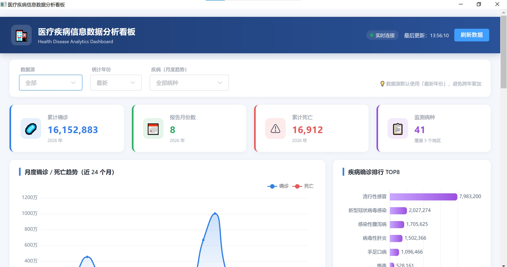
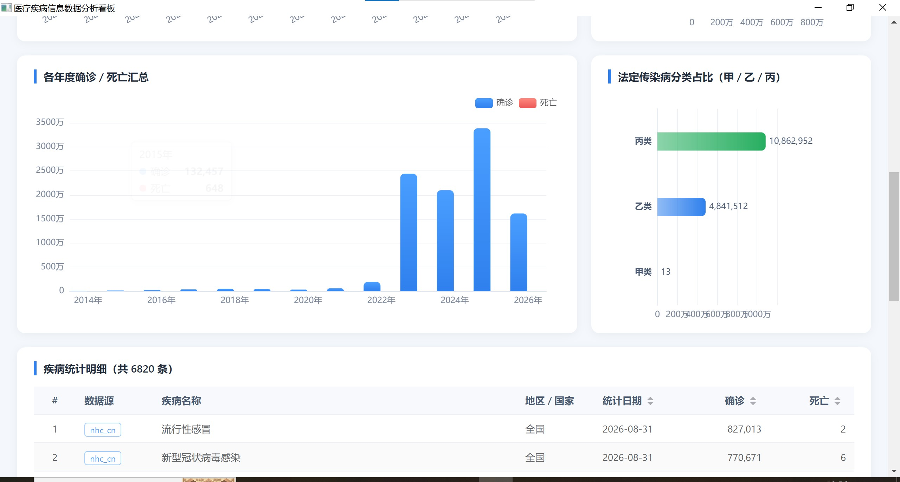
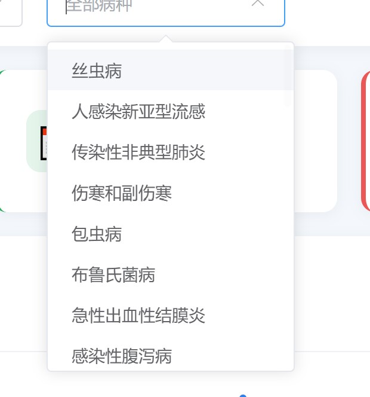
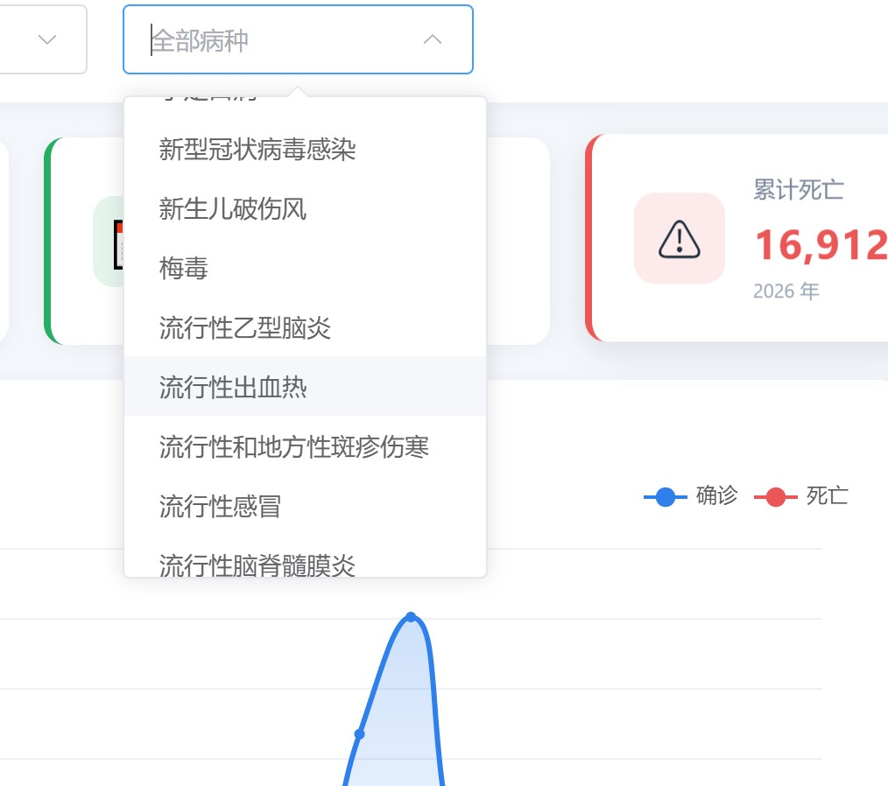
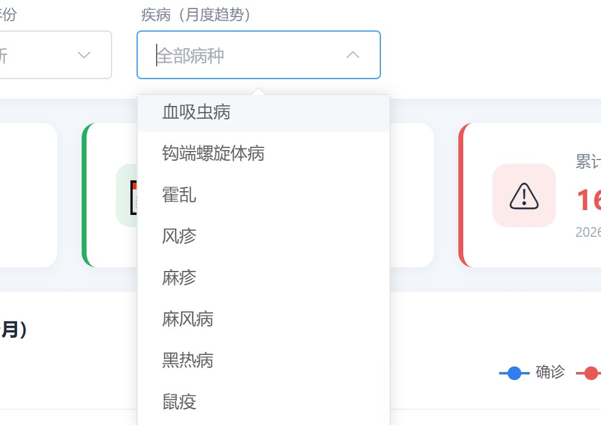
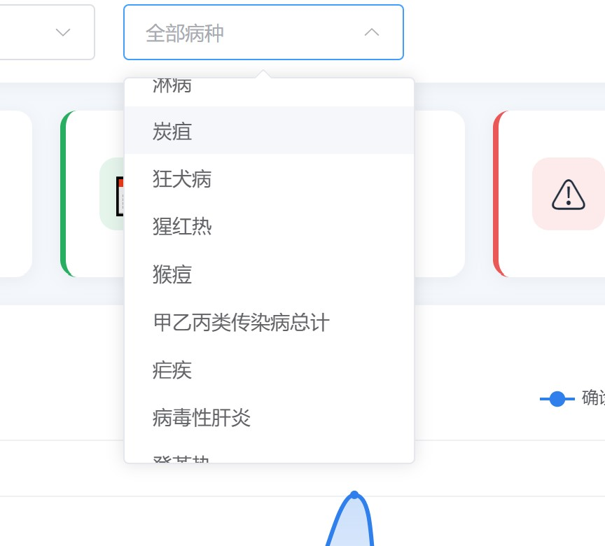
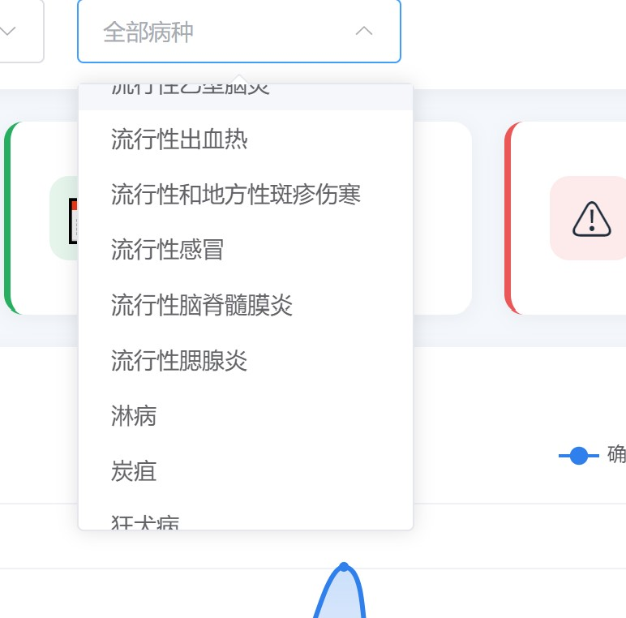
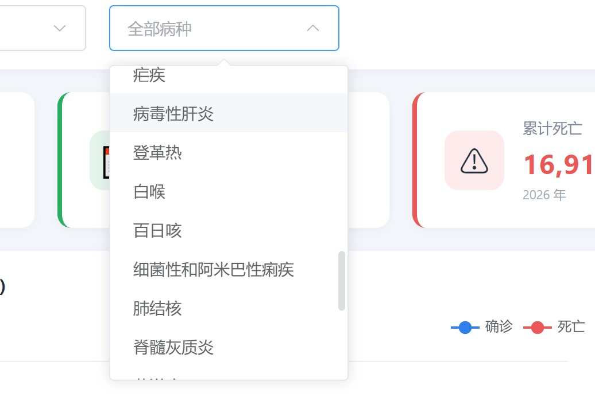

# 医疗疾病信息数据分析看板

> Health Disease Analytics Dashboard

一个开源的桌面应用，自动采集中国法定传染病疫情数据，实时展示可视化分析看板。



## ✨ 功能特性

- **5 个数据源**：国家卫健委 + 广东 / 浙江 / 江苏 / 山东 4 省卫健委
- **12 年历史数据**：覆盖 2014 ~ 2026 年
- **40 种法定传染病**：甲类 2 种 + 乙类 27 种 + 丙类 11 种
- **实时自动更新**：打开应用自动检查数据、缺什么补什么
- **零依赖安装**：内置 Python 运行时，用户不需要装任何开发环境
- **可视化看板**：KPI 卡片、月度趋势、年度对比、疾病排行、甲乙丙分类占比
- **多维度筛选**：按数据源 / 年份 / 疾病下钻分析

## 📸 截图

| 看板主界面 | 疾病明细 |
|-----------|---------|
|  |  |

## 🚀 快速开始

### 方式 1：下载安装包（推荐普通用户）

1. 打开 [Releases](../../releases) 页面
2. 下载最新版 `HealthDashboard Setup x.x.x.exe`
3. 双击安装，按向导完成
4. 双击桌面"医疗疾病信息看板"图标启动

**首次启动会**：自动创建数据库 → 后台抓取历史数据（约 2 分钟）→ 展示完整看板

### 方式 2：从源码运行（开发者）

**环境要求**：
- Python 3.10+
- Node.js 18+
- Git

**步骤**：

```bash
# 1. 克隆仓库
git clone https://github.com/<your-username>/health-dashboard.git
cd health-dashboard

# 2. 安装 Python 依赖
python -m venv .venv
.venv\Scripts\activate       # Windows
# source .venv/bin/activate  # macOS/Linux
pip install -r requirements.txt

# 3. 安装前端依赖
cd frontend
npm install
npm run build
cd ..

# 4. 启动后端
cd backend
python main.py
# 浏览器打开 http://127.0.0.1:8000
🏗️ 技术栈
层	技术
前端	Vue 3 + Element Plus + ECharts + Vite
后端	FastAPI + SQLite + WebSocket
采集	httpx + BeautifulSoup4 + python-docx + pywin32
桌面	Electron + electron-builder
打包	PyInstaller（Python 运行时内嵌）
📁 项目结构
text
health-dashboard/
├── backend/              # FastAPI 后端
│   ├── api/             # 路由层
│   ├── main.py          # 入口
│   ├── db.py            # SQLite 连接
│   └── init_db.py       # 建表脚本
├── collector/            # 数据采集
│   ├── adapters/        # 数据源适配器（每个省一个文件）
│   ├── run_sync.py      # 同步入口
│   └── db.py
├── frontend/             # Vue 3 前端
│   └── src/
├── electron/             # Electron 壳
│   ├── main.js
│   └── package.json
├── build/                # PyInstaller 打包配置
│   ├── backend.spec
│   ├── collector.spec
│   └── build.bat
└── requirements.txt
📊 数据源说明
数据源	覆盖范围	时间跨度	完整性
nhc_cn	全国	近 3 年	40 种完整
gd_cn	广东省	2018 至今	40 种完整
zj_cn	浙江省	2021 至今	40 种完整
js_cn	江苏省	2022 至今	兼容 .doc/.docx
sd_cn	山东省	2014 至今	前 N 位病种
数据来源：各卫健委官网公开发布的月度疫情通报。

🔧 扩展新数据源
只需 3 步：

在 collector/adapters/ 下新建 your_adapter.py

继承 BaseAdapter，实现 fetch() 方法

在 backend/init_db.py 的 DEFAULT_SOURCES 里注册

框架会自动发现并调度新适配器，不需要修改任何其他代码。

参考 collector/adapters/gd_province.py 的完整实现。

🛠️ 打包桌面应用
bash
# 1. 打包 Python exe（PyInstaller）
cd build
build.bat

# 2. 打包 Electron
cd ../electron
npm run build

# 3. 产物
# release/HealthDashboard Setup 1.0.0.exe
📄 数据存储
用户数据目录（Windows）：

text
%APPDATA%\HealthDashboard\
├── health_dashboard.db    # SQLite 数据库
└── logs\                  # 运行日志
卸载程序会自动清理这个目录。

🤝 贡献
欢迎提 Issue 和 PR！详见 CONTRIBUTING.md。

📜 许可证
MIT License

⚠️ 免责声明
本项目仅用于数据分析技术学习与研究，所有数据来自卫健委官网公开信息。
不构成任何医疗建议，不对数据的完整性和准确性做保证